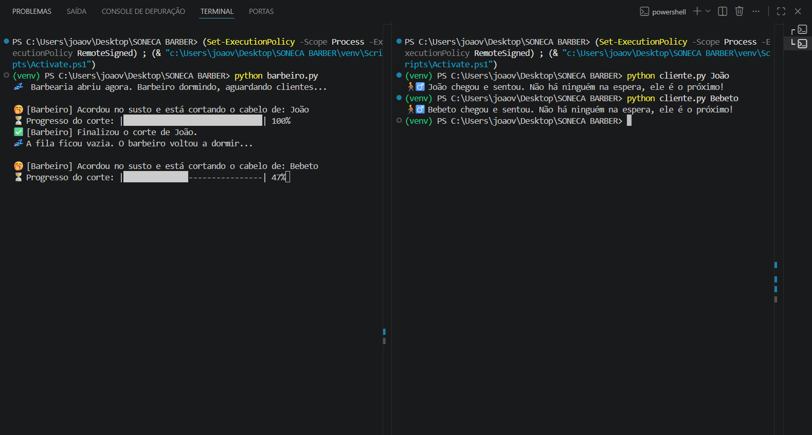

# 💈 Soneca Barber App

Trabalho prático da disciplina de **Sistemas Distribuídos**, implementando uma solução para o clássico problema de concorrência e sincronização de processos conhecido como "Barbeiro Dorminhoco". O projeto foi desenvolvido utilizando arquitetura de mensageria com RabbitMQ e Python.

## 🧑🏻‍🎓 Integrantes
* **Alunos:** João Victor Costa Arruda, [Nome do Aluno 2], [Nome do Aluno 3]
* **Professor:** [Nome do Professor]
* **Curso:** Sistemas de Informação - 6° Período
* **Disciplina:** Sistemas Distribuídos
* **Data de Entrega:** Até dia 29/04
  
## 🎯 Visão Geral do Projeto
Este projeto simula o funcionamento da barbearia Soneca utilizando um sistema de mensageria para gerenciar a comunicação assíncrona entre clientes e o barbeiro. O objetivo é não deixar o barbeiro dormir se houver clientes, respeitando estritamente as seguintes situações:

- Na abertura, sem clientes, o barbeiro dorme.  
- Se chegam clientes, o barbeiro acorda e os atende um por vez.  
- A barbearia possui um número limitado de cadeiras na sala de espera; se um cliente chegar e tudo estiver lotado, ele vai embora.  

---

## 💻 Recursos Principais
- **Arquitetura Produtor/Consumidor** — O script `cliente.py` atua como Produtor (enviando mensagens para a fila) e o `barbeiro.py` atua como Consumidor (processando as mensagens).   
- **Controle de Lotação (Reject-Publish)** — A fila do RabbitMQ foi configurada com um limite físico de cadeiras. Clientes excedentes são rejeitados ativamente pelo servidor através de um `NackError`.   
- **Qualidade de Serviço (QoS)** — Uso de `prefetch_count=1` e `basic_ack` para garantir que o barbeiro processe e finalize o corte de apenas um cliente por vez, evitando gargalos.
- **Consciência de Estado** — Os scripts inspecionam o servidor de forma passiva (`passive=True` e `message_count`) para saber exatamente quantos clientes estão na fila de espera em tempo real.
- **Interface Rica no Terminal** — Utilização da biblioteca `Rich` para exibir painéis coloridos, feedback visual claro de sucesso/rejeição e uma barra de progresso animada com tempo restante estimado.

---

## 📂 Estrutura da Mensageria (RabbitMQ)
A comunicação ocorre através de uma fila durável chamada `sala_espera`. No código em Python, a declaração utiliza a biblioteca Pika e seus argumentos de configuração garantem a regra de negócio da lotação física do estabelecimento:

```python
# Configuração dos limites físicos da barbearia
args = {"x-max-length": 3, "x-overflow": "reject-publish"}

# Declaração da fila no RabbitMQ
channel.queue_declare(queue='sala_espera', durable=True, arguments=args)
```

# 📸 Print da Aplicação


## 🛠️ Como Executar a Aplicação

### Pré-requisitos
* Python 3.x instalado.
* Servidor RabbitMQ instalado e rodando (nativamente ou via Docker).
* Bibliotecas Python necessárias (`pika` e `rich`).

### Passo a Passo
1.  Clone este repositório:
    ```bash
    git clone [https://github.com/jvarrudx/SonecaBarber-App.git](https://github.com/jvarrudx/SonecaBarber-App.git)
    ```
2.  Abra a pasta do projeto no seu terminal.
3.  Instale as dependências:
    ```bash
    pip install -r requirements.txt
    ```
4.  Certifique-se de que o servidor RabbitMQ está em execução na sua máquina (`localhost`).
5.  Em um terminal, inicie a barbearia executando o barbeiro:
    ```bash
    python barbeiro.py
    ```
6.  Abra um **segundo terminal** e envie os clientes passando o nome como argumento:
    * Exemplo: `python cliente.py Bebeto`
    * Exemplo: `python cliente.py Taka`
    * Exemplo: `python cliente.py JV`